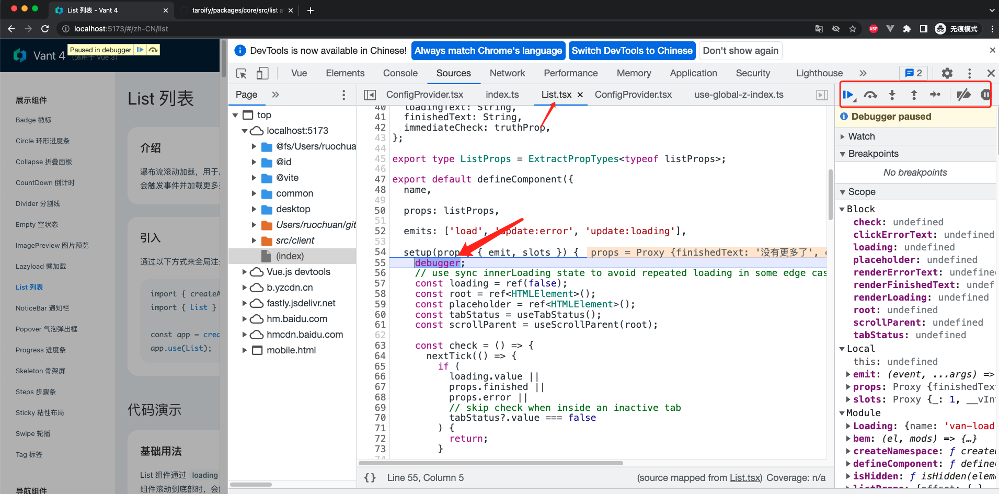
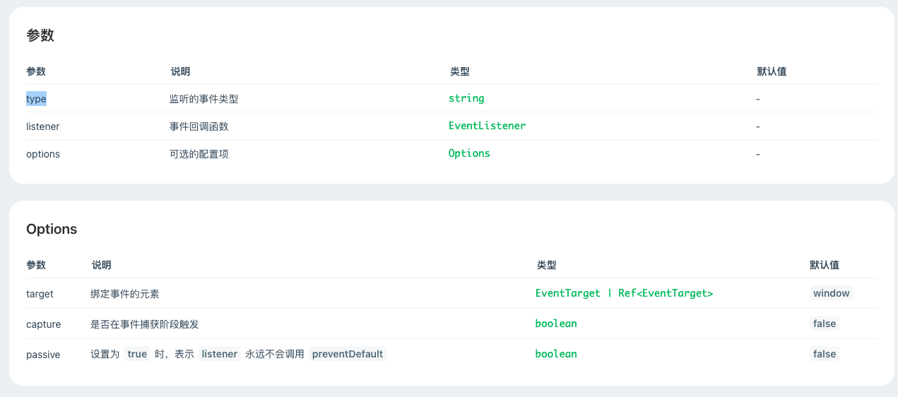

# 分析 vant4 源码，如何用 vue3 + ts 开发一个瀑布流滚动加载的列表组件？

本文为稀土掘金技术社区首发签约文章，14天内禁止转载，14天后未获授权禁止转载，侵权必究！

## 1. 前言

大家好，我是[若川](https://lxchuan12.gitee.io)。我倾力持续组织了一年[每周大家一起学习200行左右的源码共读活动](https://juejin.cn/post/7079706017579139102)，感兴趣的可以[点此扫码加我微信 `ruochuan12` 参与](https://juejin.cn/pin/7005372623400435725)。另外，想学源码，极力推荐关注我写的专栏[《学习源码整体架构系列》](https://juejin.cn/column/6960551178908205093)，目前是掘金关注人数（4.1k+人）第一的专栏，写有20余篇源码文章。

我们开发业务时经常会使用到组件库，一般来说，很多时候我们不需要关心内部实现。但是如果希望学习和深究里面的原理，这时我们可以分析自己使用的组件库实现。有哪些优雅实现、最佳实践、前沿技术等都可以值得我们借鉴。

相比于原生 `JS` 等源码。我们或许更应该学习，正在使用的组件库的源码，因为有助于帮助我们写业务和写自己的组件。

如果是 `Vue` 技术栈，开发移动端的项目，大多会选用 `vant` 组件库，目前（2022-11-13） `star` 多达 `20.4k`。我们可以挑选 `vant` 组件库学习，我会写一个[组件库源码系列专栏](https://juejin.cn/column/7140264842954276871)，欢迎大家关注。

- [vant 4 即将正式发布，支持暗黑主题，那么是如何实现的呢](https://juejin.cn/post/7158239404484460574)
- [跟着 vant4 源码学习如何用 vue3+ts 开发一个 loading 组件，仅88行代码](https://juejin.cn/post/7160465286036979748)

学完本文，你将学到：

```bash
1. 学会如何用 vue3 + ts 开发一个 List 组件
2. 学会封装各种组合式 `API`
3. 等等
```

## 2. 准备工作

看一个开源项目，第一步应该是先看 [README.md](https://github.com/youzan/vant) 再看贡献文档 [github/CONTRIBUTING.md](https://github.com/youzan/vant/blob/main/.github/CONTRIBUTING.md)。

### 2.1 克隆源码 && 跑起来

You will need [Node.js >= 14](https://nodejs.org) and [pnpm](https://pnpm.io).

```bash
# 推荐克隆我的项目
git clone https://github.com/lxchuan12/vant-analysis
cd vant-analysis/vant

# 或者克隆官方仓库
git clone git@github.com:vant-ui/vant.git
cd vant

# 安装依赖，会运行所有 packages 下仓库的 pnpm i 钩子 pnpm prepare 和 pnpm i
pnpm i

# Start development
pnpm dev
```

我们先来看 `pnpm dev` 最终执行的什么命令。

`vant` 项目使用的是 `monorepo` 结构。查看根路径下的 `package.json`。

`vant/package.json => "dev": "pnpm --dir ./packages/vant dev"`
`vant/packages/vant/package.json` => `"dev": "vant-cli dev"`

`pnpm dev` 最终执行的是：`vant-cli dev` 执行测试用例。本文主要是学习 [List 组件](https://vant-contrib.gitee.io/vant/#/zh-CN/list) 的实现，所以我们就不深入 `vant-cli dev` 命令了。

## 3. List 组件

[List 组件文档](https://vant-contrib.gitee.io/vant/#/zh-CN/list)

>瀑布流滚动加载，用于展示长列表，当列表即将滚动到底部时，会触发事件并加载更多列表项。

从这个描述和我们自己体验 `demo` 来。
至少有以下三个问题值得去了解学习。

- 如何监听滚动
- 如何计算滚动到了底部
- 如何触发事件加载更多

带着问题我们直接找到 list demo 文件：`vant/packages/vant/src/list/demo/index.vue`。为什么是这个文件，我在上篇文章[跟着 vant4 源码学习如何用 vue3+ts 开发一个 loading 组件，仅88行代码](https://juejin.cn/post/7160465286036979748#heading-3)分析了其原理，感兴趣的小伙伴点击查看。这里就不赘述了。

### 3.1 利用 demo 调试

组件源码中的 `TS` 代码我不会过多解释。没学过 `TS` 的小伙伴，推荐学这个[TypeScript 入门教程](http://ts.xcatliu.com/)。
另外，`vant` 使用了 [@vue/babel-plugin-jsx](https://www.npmjs.com/package/@vue/babel-plugin-jsx) 插件来支持 `JSX、TSX`。

```js
// vant/packages/vant/src/list/demo/index.vue
// 代码有删减
<script setup lang="ts">
import VanList from '..';
import { ref } from 'vue';

const t = useTranslate({
  'zh-CN': {
    errorInfo: '错误提示',
    errorText: '请求失败，点击重新加载',
    pullRefresh: '下拉刷新',
    finishedText: '没有更多了',
  },
  'en-US': {
    errorInfo: 'Error Info',
    errorText: 'Request failed. Click to reload',
    pullRefresh: 'PullRefresh',
    finishedText: 'Finished',
  },
});

const list = ref([
  {
    items: [] as string[],
    refreshing: false,
    loading: false,
    error: false,
    finished: false,
  },
]);

// 加载数据
const onLoad = (index: number) => {
  const currentList = list.value[index];
  currentList.loading = true;

  setTimeout(() => {
    if (currentList.refreshing) {
      currentList.items = [];
      currentList.refreshing = false;
    }

    for (let i = 0; i < 10; i++) {
      const text = currentList.items.length + 1;
      currentList.items.push(text < 10 ? '0' + text : String(text));
    }

    currentList.loading = false;
    currentList.refreshing = false;

    // show error info in second demo
    if (index === 1 && currentList.items.length === 10 && !currentList.error) {
      currentList.error = true;
    } else {
      currentList.error = false;
    }

    if (currentList.items.length >= 40) {
      currentList.finished = true;
    }
  }, 1000);
};
</script>
<template>
  <van-tabs>
    <van-tab :title="t('basicUsage')">
      <van-list
        v-model:loading="list[0].loading"
        :finished="list[0].finished"
        :finished-text="t('finishedText')"
        @load="onLoad(0)"
      >
        <van-cell v-for="item in list[0].items" :key="item" :title="item" />
      </van-list>
    </van-tab>
<template>
```

## 4. 入口文件

主要就是导出一下类型和变量等。

```js
// vant/packages/vant/src/list/index.ts
import { withInstall } from '../utils';
import _List, { ListProps } from './List';

export const List = withInstall(_List);
export default List;
export { listProps } from './List';
export type { ListProps };
export type { ListInstance, ListDirection, ListThemeVars } from './types';

declare module 'vue' {
  export interface GlobalComponents {
    VanList: typeof List;
  }
}
```

`withInstall` 函数在上篇文章[5.1 withInstall 给组件对象添加 install 方法](https://juejin.cn/post/7160465286036979748#heading-10) 也有分析，这里就不赘述了。

我们可以在这些文件，任意位置加上 `debugger` 调试源码。

## 5. 主文件

```js
import {
  ref,
  watch,
  nextTick,
  onUpdated,
  onMounted,
  defineComponent,
  type ExtractPropTypes,
} from 'vue';

// Utils
import {
  isHidden,
  truthProp,
  makeStringProp,
  makeNumericProp,
  createNamespace,
} from '../utils';

// Composables
import { useRect, useScrollParent, useEventListener } from '@vant/use';
import { useExpose } from '../composables/use-expose';
import { useTabStatus } from '../composables/use-tab-status';

// Components
import { Loading } from '../loading';

// Types
import type { ListExpose, ListDirection } from './types';

const [name, bem, t] = createNamespace('list');

export const listProps = {
  error: Boolean,
  offset: makeNumericProp(300),
  loading: Boolean,
  finished: Boolean,
  errorText: String,
  direction: makeStringProp<ListDirection>('down'),
  loadingText: String,
  finishedText: String,
  immediateCheck: truthProp,
};

export type ListProps = ExtractPropTypes<typeof listProps>;
```

[List 组件 api](https://vant-contrib.gitee.io/vant/v4/#/zh-CN/list#api)

```js
export default defineComponent({
  name,
  props: listProps,

  emits: ['load', 'update:error', 'update:loading'],

  setup(props, { emit, slots }) {
    // TODODEL: 可以在这里打上断点调试，或者其他地方。
    debugger;
    // 省略若干代码
    const loading = ref(false);
    const root = ref<HTMLElement>();
    const placeholder = ref<HTMLElement>();
    const tabStatus = useTabStatus();
    const scrollParent = useScrollParent(root);
    // 省略若干代码
    return () => {
      const Content = slots.default?.();
      const Placeholder = <div ref={placeholder} class={bem('placeholder')} />;

      return (
        <div ref={root} role="feed" class={bem()} aria-busy={loading.value}>
          {props.direction === 'down' ? Content : Placeholder}
          //   比如：加载中
          {renderLoading()}
          //   结束文字 比如：没有更多了
          {renderFinishedText()}
          //   加载错误文字：比如加载失败
          {renderErrorText()}
          {props.direction === 'up' ? Content : Placeholder}
        </div>
      );
    };
  }
}
```

`debugger` 调试截图。


接着我们来看其他一些事件。

### 5.1 一些事件 useExpose、useEventListener

```js
// 省略若干代码
setup(props, { emit, slots }) {
    // 省略 check 函数，后文讲述
    const check = () => {}

    // 监听参数变更，执行 check
    watch(() => [props.loading, props.finished, props.error], check);

    // van-tabs tab 切换状态变更时 执行 check
    if (tabStatus) {
      watch(tabStatus, (tabActive) => {
        if (tabActive) {
          check();
        }
      });
    }

    onUpdated(() => {
    // ！是 ts中的非空断言，很多人问过
      loading.value = props.loading!;
    });

    // 如果参数是立即检测，执行 check 函数
    onMounted(() => {
      if (props.immediateCheck) {
        check();
      }
    });

    // 导出 check 函数，让 refs.xxx 可以使用
    useExpose<ListExpose>({ check });

    // 监听滚动事件，执行 check 函数
    useEventListener('scroll', check, {
      target: scrollParent,
      passive: true,
    });
}
```

由上面代码可以看出，`check` 函数非常重要，我们在下文分析它。

我们先分析上面代码用到的 `useExpose`、`useEventListener` 组合式 `API`。

### 5.2 useExpose 暴露

```js
import { getCurrentInstance } from 'vue';
import { extend } from '../utils';

// expose public api
export function useExpose<T = Record<string, any>>(apis: T) {
  const instance = getCurrentInstance();
  if (instance) {
    extend(instance.proxy as object, apis);
  }
}
```

通过 `ref` 可以获取到 `List` 实例并调用实例方法，详见[组件实例方法](https://vant-contrib.gitee.io/vant/v4/#/zh-CN/advanced-usage#zu-jian-shi-li-fang-fa)。

>`Vant` 中的许多组件提供了实例方法，调用实例方法时，我们需要通过 `ref` 来注册组件引用信息，引用信息将会注册在父组件的 `$refs` 对象上。注册完成后，我们可以通过 `this.$refs.xxx` 访问到对应的组件实例，并调用上面的实例方法。

### 5.3 useEventListener 绑定事件

方便地进行事件绑定，在组件 `mounted` 和 `activated` 时绑定事件，`unmounted` 和 `deactivated` 时解绑事件。



```js
import { Ref, watch, isRef, unref, onUnmounted, onDeactivated } from 'vue';
import { onMountedOrActivated } from '../onMountedOrActivated';
import { inBrowser } from '../utils';

type TargetRef = EventTarget | Ref<EventTarget | undefined>;

export type UseEventListenerOptions = {
  target?: TargetRef;
  capture?: boolean;
  passive?: boolean;
};

// TS 函数重载
// 重载 可以参考这里：http://ts.xcatliu.com/basics/type-of-function.html#%E9%87%8D%E8%BD%BD
export function useEventListener<K extends keyof DocumentEventMap>(
  type: K,
  listener: (event: DocumentEventMap[K]) => void,
  options?: UseEventListenerOptions
): void;
export function useEventListener(
  type: string,
  listener: EventListener,
  options?: UseEventListenerOptions
): void;
export function useEventListener(
  type: string,
  listener: EventListener,
  options: UseEventListenerOptions = {}
) {
    // 如果不是浏览器环境，直接返回，比如 SSR
  if (!inBrowser) {
    return;
  }

  const { target = window, passive = false, capture = false } = options;

  let attached: boolean;

  // 添加事件
  const add = (target?: TargetRef) => {
    const element = unref(target);

    if (element && !attached) {
      element.addEventListener(type, listener, {
        capture,
        passive,
      });
      attached = true;
    }
  };

  // 移除事件
  const remove = (target?: TargetRef) => {
    const element = unref(target);

    if (element && attached) {
      element.removeEventListener(type, listener, capture);
      attached = false;
    }
  };

  // 移除事件
  onUnmounted(() => remove(target));
  onDeactivated(() => remove(target));
  onMountedOrActivated(() => add(target));

  if (isRef(target)) {
    watch(target, (val, oldVal) => {
      remove(oldVal);
      add(val);
    });
  }
}

```

## 6. steup check 函数

```js
const check = () => {
    nextTick(() => {
        // 正在 loading 或者已经完成加载
        // 或者加载失败，或者tab的状态不是激活时，返回。
        if (
            loading.value ||
            props.finished ||
            props.error ||
            // skip check when inside an inactive tab
            tabStatus?.value === false
        ) {
            return;
        }

        // offset 默认 300
        const { offset, direction } = props;
        // 滚动的父级元素的位置
        const scrollParentRect = useRect(scrollParent);

        if (!scrollParentRect.height || isHidden(root)) {
            return;
        }

        // 触底计算
        // 滚动父元素 和 占位元素
        let isReachEdge = false;
        const placeholderRect = useRect(placeholder);

        if (direction === 'up') {
            isReachEdge = scrollParentRect.top - placeholderRect.top <= offset;
        } else {
            isReachEdge =
            placeholderRect.bottom - scrollParentRect.bottom <= offset;
        }

        // 触底了
        if (isReachEdge) {
            loading.value = true;
            emit('update:loading', true);
            emit('load');
        }
    });
};
```

从 `check` 函数可以看出，主要就是利用滚动高度，接下来我们看这个函数中，使用到的组合式 `API`，`useTabStatus`、`useScrollParent`、`useRect`。

### 6.1 useTabStatus tab 组件的状态

```js
import { inject, ComputedRef, InjectionKey } from 'vue';

// eslint-disable-next-line
export const TAB_STATUS_KEY: InjectionKey<ComputedRef<boolean>> = Symbol();

export const useTabStatus = () => inject(TAB_STATUS_KEY, null);
```

代码根据 `commit` 可以发现 `useTabStatus` 有这样一次提交。

[fix(List): skip check when inside an inactive tab](https://github.com/youzan/vant/pull/8741/files)

主要是在 `van-tabs` 组件中，`provide(TAB_STATUS_KEY, active);` 提供了一个状态。`tab` 不活跃时，跳过 `check` 函数，不执行。

### 6.2 useScrollParent 获取元素最近的可滚动父元素

获取元素最近的可滚动父元素。

给定参数 `el, root` 节点，遍历父级节点查找 `style` 包含 `scroll|auto|overlay` 的元素，如果没找到，返回第二个 `root` 参数（没有第二个参数则是 `window`）。

[useScrollParent 文档](https://vant-contrib.gitee.io/vant/v4/#/zh-CN/use-scroll-parent)

```js
import { ref, Ref, onMounted } from 'vue';
import { inBrowser } from '../utils';

type ScrollElement = HTMLElement | Window;

const overflowScrollReg = /scroll|auto|overlay/i;
const defaultRoot = inBrowser ? window : undefined;

// 元素节点
function isElement(node: Element) {
  const ELEMENT_NODE_TYPE = 1;
  return (
    node.tagName !== 'HTML' &&
    node.tagName !== 'BODY' &&
    node.nodeType === ELEMENT_NODE_TYPE
  );
}

// https://github.com/vant-ui/vant/issues/3823
export function getScrollParent(
  el: Element,
  root: ScrollElement | undefined = defaultRoot
) {
  let node = el;

  // 遍历得到父级滚动的元素，style 样式包含 scroll|auto|overlay 的节点
  while (node && node !== root && isElement(node)) {
    const { overflowY } = window.getComputedStyle(node);
    if (overflowScrollReg.test(overflowY)) {
      return node;
    }
    node = node.parentNode as Element;
  }

  // 没找到返回参数 root，如果没传参，默认是 window
  return root;
}

export function useScrollParent(
  el: Ref<Element | undefined>,
  root: ScrollElement | undefined = defaultRoot
) {
  const scrollParent = ref<Element | Window>();

  onMounted(() => {
    if (el.value) {
      scrollParent.value = getScrollParent(el.value, root);
    }
  });

  return scrollParent;
}
```

### 6.3 useRect 获取元素的大小及其相对于视口的位置

https://vant-contrib.gitee.io/vant/#/zh-CN/use-rect

获取元素的大小及其相对于视口的位置，等价于 [Element.getBoundingClientRect](https://developer.mozilla.org/zh-CN/docs/Web/API/Element/getBoundingClientRect)。


```js
// vant/packages/vant-use/src/useRect/index.ts
import { Ref, unref } from 'vue';

const isWindow = (val: unknown): val is Window => val === window;

const makeDOMRect = (width: number, height: number) =>
  ({
    top: 0,
    left: 0,
    right: width,
    bottom: height,
    width,
    height,
  } as DOMRect);

export const useRect = (
  elementOrRef: Element | Window | Ref<Element | Window | undefined>
) => {
    // unref()：如果参数是 ref，则返回内部值，否则返回参数本身。这是 val = isRef(val) ? val.value : val 计算的一个语法糖。
  const element = unref(elementOrRef);

  // 如果是 window 直接返回 innerWidth 和 innerHeight 
  if (isWindow(element)) {
    const width = element.innerWidth;
    const height = element.innerHeight;
    return makeDOMRect(width, height);
  }

  // 否则用 getBoundingClientRect api
  if (element?.getBoundingClientRect) {
    return element.getBoundingClientRect();
  }

  // 不支持的情况下返回 0 0
  return makeDOMRect(0, 0);
};

```

### 6.4 isHidden 是否隐藏

```js
// vant/packages/vant/src/utils/dom.ts
export function isHidden(
  elementRef: HTMLElement | Ref<HTMLElement | undefined>
) {
  const el = unref(elementRef);
  if (!el) {
    return false;
  }

  const style = window.getComputedStyle(el);
  const hidden = style.display === 'none';

  // offsetParent returns null in the following situations:
  // 1. The element or its parent element has the display property set to none.
  // 2. The element has the position property set to fixed
  const parentHidden = el.offsetParent === null && style.position !== 'fixed';

  return hidden || parentHidden;
}
```

接着我们来分析开头的插槽部分。

## 7. 插槽

插槽部分基本都是有插槽用插槽没有则用默认的。

插槽是函数，比如 `slots.default()`。

```js
// setup 函数
return () => {
    const Content = slots.default?.();
    const Placeholder = <div ref={placeholder} class={bem('placeholder')} />;

    return (
        <div ref={root} role="feed" class={bem()} aria-busy={loading.value}>
            {props.direction === 'down' ? Content : Placeholder}
            //   比如：加载中
            {renderLoading()}
            //   结束文字 比如：没有更多了
            {renderFinishedText()}
            //   加载错误文字：比如加载失败
            {renderErrorText()}
            {props.direction === 'up' ? Content : Placeholder}
        </div>
    );
};
```

### 7.1 renderFinishedText 渲染加载完成文字

```js
const renderFinishedText = () => {
    if (props.finished) {
        const text = slots.finished ? slots.finished() : props.finishedText;
        if (text) {
            return <div class={bem('finished-text')}>{text}</div>;
        }
    }
};
```

### 7.2 renderErrorText 渲染加载失败文字

```js
const clickErrorText = () => {
    emit('update:error', false);
    check();
};

const renderErrorText = () => {
    if (props.error) {
        const text = slots.error ? slots.error() : props.errorText;
        if (text) {
            return (
                <div
                    role="button"
                    class={bem('error-text')}
                    tabindex={0}
                    onClick={clickErrorText}
                >
                    {text}
                </div>
            );
        }
    }
};
```

### 7.3 renderLoading  渲染 loading

```js
const renderLoading = () => {
    if (loading.value && !props.finished) {
        return (
            <div class={bem('loading')}>
            {slots.loading ? (
                slots.loading()
            ) : (
                <Loading class={bem('loading-icon')}>
                {props.loadingText || t('loading')}
                </Loading>
            )}
            </div>
        );
    }
};
```

## 8. 总结

我们主要分析了 [`List` 组件](https://vant-contrib.gitee.io/vant/#/zh-CN/list) 实现原理。

原理：使用 `addEventListener` 监听父级元素的 `sroll` 事件，用 [Element.getBoundingClientRect](https://developer.mozilla.org/zh-CN/docs/Web/API/Element/getBoundingClientRect) 获取元素的大小及其相对于视口的位置，（滚动父级元素和占位元素计算和组件属性 `offset（默认300）` 属性比较），检测是否触底，触底则加载更多。

```js
emit('update:loading', true);
emit('load');
```

同时分析了一些相关组合式 `API`

- `useExpose` 暴露接口供 `this.$refs.xxx` 使用
- `useEventListener` 绑定事件
- `useTabStatus` 当前 `tab` 是否激活的状态
- `useScrollParent` 获取元素最近的可滚动父元素
- `useRect` 获取元素的大小及其相对于视口的位置

组件留有四个插槽，分别是：

- `default`  列表内容
- `loading`  自定义底部加载中提示
- `finished`  自定义加载完成后的提示文案
- `error`  自定义加载失败后的提示文案

至此，我们就分析完了 `List` 组件，主要与 `DOM` 操作会比较多。`List 组件` 主文件的代码仅有 `100` 多行，但封装了很多组合式 `API` 。看完这篇源码文章，再去看 [List 组件文档](https://vant-contrib.gitee.io/vant/#/zh-CN/list)，可能就会有豁然开朗的感觉。再看其他组件，可能就可以猜测出大概实现的代码了。

如果是使用 `react`、`Taro` 技术栈，感兴趣也可以看看 `taroify` `List` 组件的实现 [文档](https://taroify.gitee.io/taroify.com/components/list)，[源码](https://github.com/mallfoundry/taroify/tree/main/packages/core/src/list)。

**如果看完有收获，欢迎点赞、评论、分享支持。你的支持和肯定，是我写作的动力**。

## 9. 加源码共读群交流

最后可以持续关注我[@若川](https://juejin.cn/user/1415826704971918)。我会写一个[组件库源码系列专栏](https://juejin.cn/column/7140264842954276871)，欢迎大家关注。

我倾力持续组织了一年[每周大家一起学习200行左右的源码共读活动](https://juejin.cn/post/7079706017579139102)，感兴趣的可以[点此扫码加我微信 `ruochuan12` 参与](https://juejin.cn/pin/7005372623400435725)。

另外，想学源码，极力推荐关注我写的专栏[《学习源码整体架构系列》](https://juejin.cn/column/6960551178908205093)，目前是掘金关注人数（4.1k+人）第一的专栏，写有20余篇源码文章。
